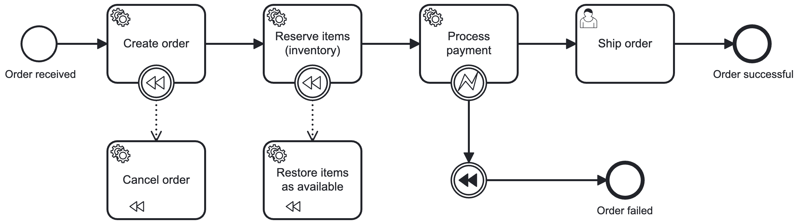

# Spring Boot BPMN Camunda

A demo project, implemented with Spring Boot, that uses [Camunda Zeebe](https://camunda.com/platform/zeebe/) workflow engine to execute a simple [ordering process](#the-process).

The Camunda Zeebe workflow engine, as well as other Camunda services, is self-managed and run in a docker container. The configuration of these services is done in the [docker-compose.yaml](docker-compose.yaml) file.

# Getting started

This section provides a step-by-step guide on how to run the project.

## Requirements

To run this project, you will need to have the following installed on your local machine:
- [Java 21](https://www.oracle.com/java/technologies/downloads/#java21)
- [Maven](https://maven.apache.org/download.cgi)
- [Docker](https://docs.docker.com/engine/install/)
- [Docker compose](https://docs.docker.com/compose/install/)

## Installing and running the project

1. Clone the repository
```shell
git clone git@github.com:andrecaiado/spring-boot-bpmn-camunda.git
```

2. Navigate into the project directory
```shell
cd your-repository-name
```

3. Create and update the .env file
```text
Create a copy of the `.env.template` and change the name to `.env`
Update the values (optional)
````

4. Start Camunda services with Docker Compose
```shell
docker compose up -d
```

5. Run the application
```shell 
mvn spring-boot:run
```

## The process

The executed process is the following:



**Notes about the process:**

To create a process instance, please refer to the [Start the process](#start-the-process) section.

In order to test the compensation events, a condition was added in the [ProcessPaymentWorker.java](src/main/java/com/example/springbootbpmncamunda/process/ProcessPaymentWorker.java) worker, and is the following:
- If the total amount is greater than 1000, the worker will throw an exception (ZeebeBpmnError), which will trigger the compensation events.

The 'Ship order' task is a user task and so, it must be completed in the [Camunda Tasklist](#check-and-execute-user-tasks).

## Try it out

In order to test the application and execute the process, you will use the following services:

- Any REST client (e.g. Postman, curl, etc.)
- Camunda Operate
- Camunda Tasklist

### Start the process

To start the process, you need to send a POST request to the `http://localhost:8080/order` endpoint. Bellow is a curl example:

```shell
curl --location 'localhost:8080/order' \
--header 'Content-Type: application/json' \
--data '{
    "total": 500,
    "items": [
        {
            "productId": "123",
            "price": 120,
            "quantity": 1
        },
        {
            "productId": "234",
            "price": 380,
            "quantity": 1
        }
    ]
}'
```

### Check the process status

To check the status of the process, you can use the Camunda Operate that is available at: [http://localhost:8081](http://localhost:8081)

The default credentials to access Camunda Operate are:
- Username: demo
- Password: demo

### Check and execute user tasks

To check the tasks, you can use the Camunda Tasklist that is available at: [http://localhost:8082](http://localhost:8082)

The default credentials to access Camunda Operate are:
- Username: demo
- Password: demo
